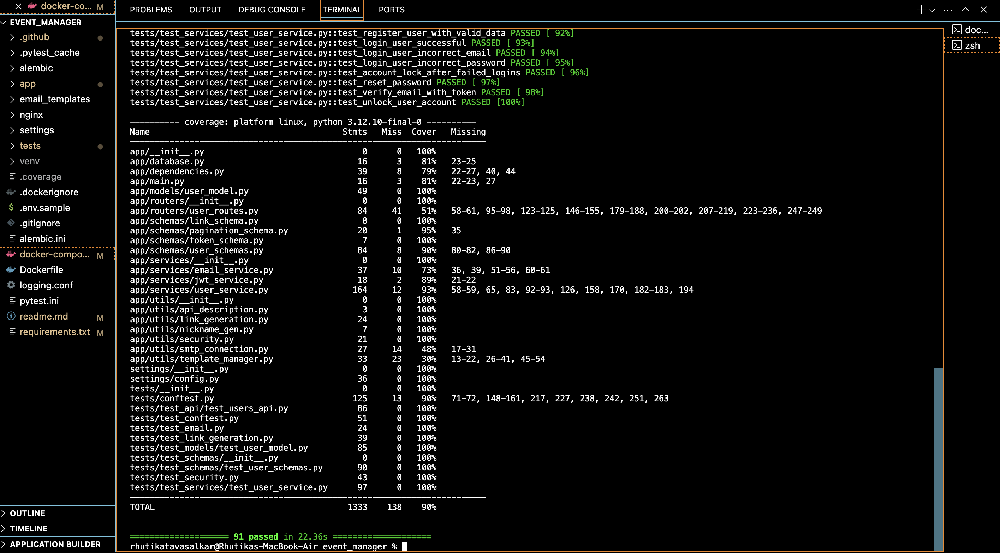
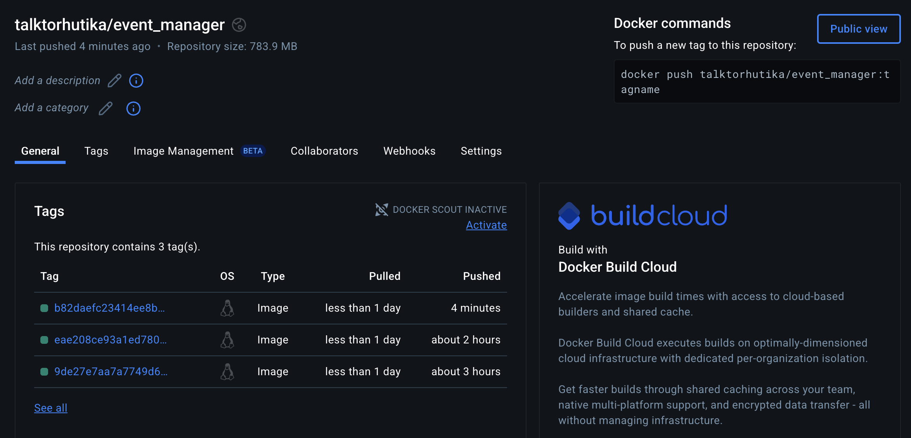

# Event Manager Company: Software QA Analyst/Developer Onboarding Assignment

## Closed Issues:

Issue 1-

The render_template function was incorrectly mocked to return a MagicMock object. This mock object was passed as the HTML content to the send_email method, leading to a failure in the assert_called_once_with assertion when verifying the method's arguments.

Resolution: Updated the mock for render_template to return a realistic HTML string. This ensures the send_email function receives content in the correct format, and the assertion now passes as expected.

Issue 2-

The nickname generation feature is currently not working as intended. The generated nicknames are often invalid, lack uniqueness, or do not comply with the defined requirements.

Resolution: Fixed the code.

Issue 3-

Currently, we use UUIDs for authentication. To improve both user-friendliness and security, we suggest replacing the UUID-based system with email verification, as every user has a unique email address.

Resolution: Enhanced security through email validation.

Issue 4-

Develop a strong password validation logic to enhance security by enforcing requirements such as the combination of special characters, at least one uppercase letter, one lowercase letter, and at least one numeric digit.

Resolution: enforcing strong password requirements like special characters, at least one uppercase & lowercase and at least one numeric value.

Issue 5-

Negative pagination should be handled correctly.

Resolution: Handled the pagination issue.

## Test Coverage
[]

## Docker
[]

## Learnings from the Assignment
This assignment provided valuable insights into both technical implementation and collaborative development practices. I deepened my understanding of REST APIs, particularly in implementing secure JWT-based OAuth2 authentication to manage user access and protect data.

Improving test coverage to 90% enhanced my skills in unit, integration, and end-to-end testing. This reinforced the value of automated tests in ensuring system stability and identifying potential bugs early.

On the collaboration front, I gained hands-on experience with Git workflows, branch management, and code reviews via pull requests. Utilizing GitHub Issues highlighted the importance of clear documentation and effective team communication.

Additionally, debugging complex issues—such as username validation, password hashing, and profile field edge cases—sharpened my problem-solving abilities and underscored the importance of thorough validation for system reliability.